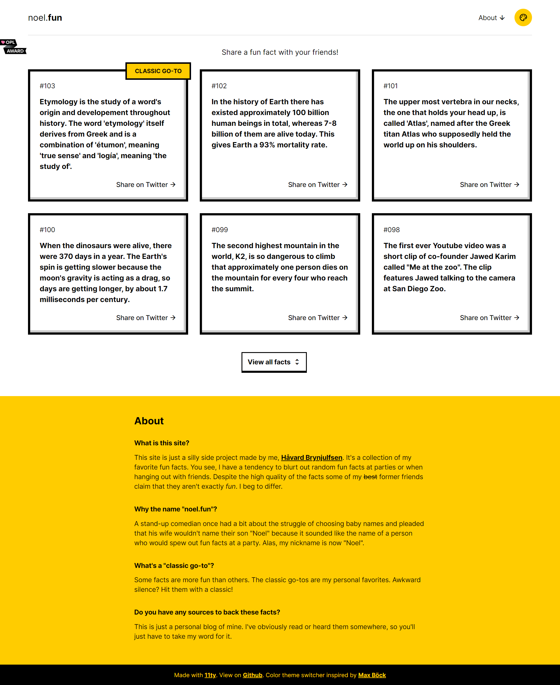
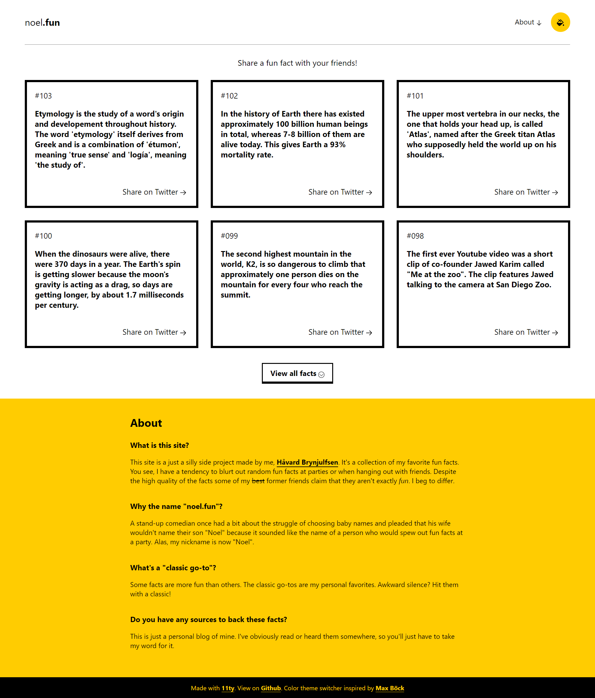

# Noel's Fun Facts (Replication)
**Languages:** HTML / CSS

**URL:** https://patk80.github.io/Noel-s-Fun-Facts-Replication/

**Description:** A UI recreation of a site I found online (https://noel.fun). I wanted to challenge myself to build a more complex web page just by looking at it. Created with HTML and CSS.

## Screenshot of Noel's Fun Facts (https://noel.fun) website:

**Desktop**

**Mobile**

## Screenshot of my version:

**Desktop**

**Mobile**

